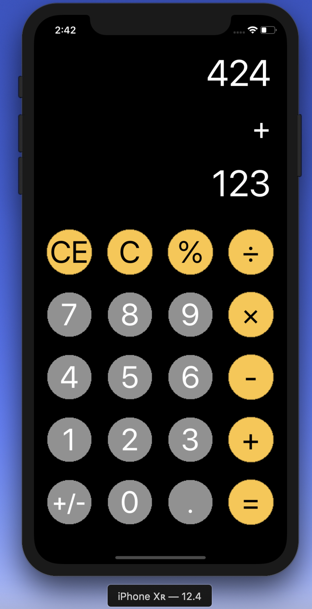

# Calculator

<p1>Using Xcode, the latest version of iOS SDK and the Swift programming language, a
calculator app has been designed that allows the user to add, subtract, multiply ,divide and modulo . The app has the
number keys (0 to 9), a reset button (CE), an erase button (C) ,the decimal button (.),positive and negative button (+/-) and an equals (=) button. Calculations are displayed in a UILabel.<p1>

